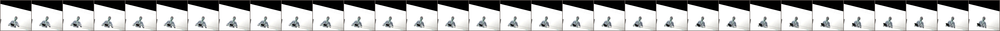
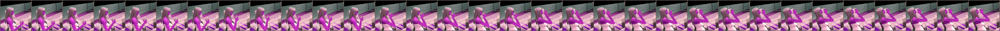
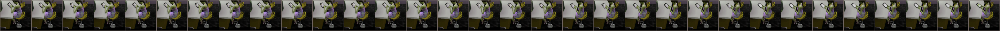
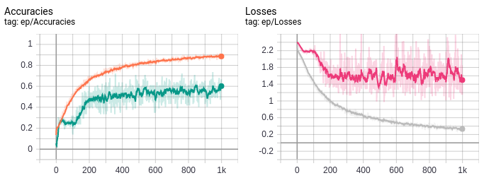
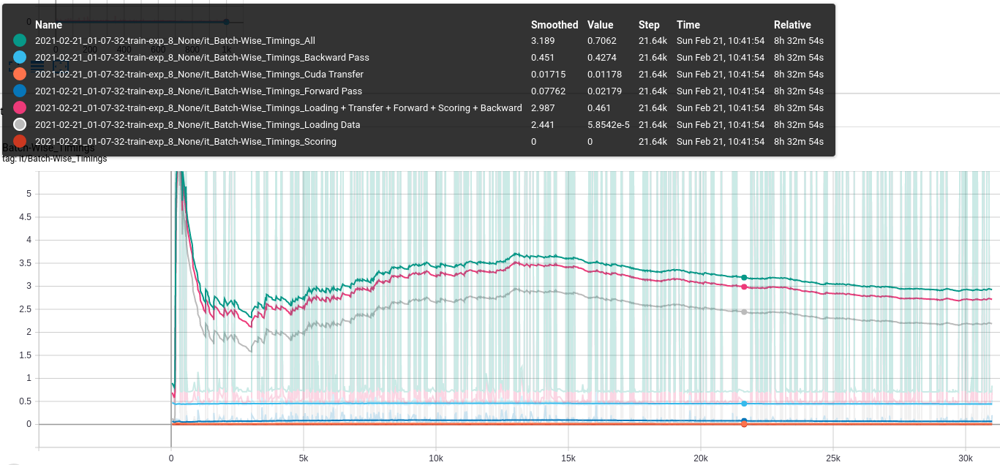
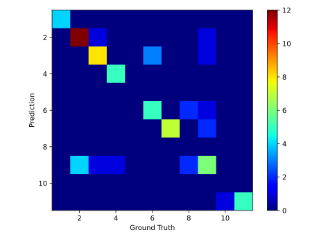

# MA Domain Adaptation

Repository for the implementation of models/data loaders/etc. for the project on Recognizing Activities of Daily Living from Life Simulations Video Games (Sims 4).

## Installation
Requirements files for pip installations can be found in the repository, but it is better to install the right set of packages for the system in use manually, especially PyTorch.
Might work with earlier versions, but untested:
* PyTorch 1.7 
* numpy 1.18
* pandas 1.1.5
* tensorboard
* tqdm

```bash
pip install torch torchvision numpy pandas tqdm wheel tensorboard
```


## Usage
Starting training on GPUs 0 and 1. The images for training are downscaled to 128 x 128.
```bash
python -u main.py --gpu 0 1 --img_dim 128 --batch_size 28 --epochs 200
```
The results are automatically saved to the folder set with `--exp_root`. By default, this is `./experiments`.
Experiment number and suffix can be set explicitly via `--exp-num` and `--exp-suffix` but are determined automatically otherwise (next free number greater than max existing exp-num existing.)

The training progress is printed to console but can be monitored in detail via
```bash
cd experiments/{exp-folder}/logs; tensorboard --logdir .
```

## Implemented Features
* Training, validation and testing on the S3D single stream architecture.
* Splits are created via a fraction setting for validation and testing. Reading fixed splits from files not implemented yet.
* Tensorboard logs


## Notes

### Augmentations
By default, the input video clips are heavily augmented during training. Examples can be seen below.





### Intermediate Results

#### S3D Single Stream (Getup and Sitdown not reordered yet.)





Classes:
```python
{
    "Cook":        1,
    "Drink":       2,
    "Eat":         3,
    "Getup":       4,
    "Sitdown":     5,
    "Readbook":    6,
    "Usecomputer": 7,
    "Usephone":    8,
    "Usetablet":   9,
    "Walk":        10,
    "WatchTV":     11,
    }
```
