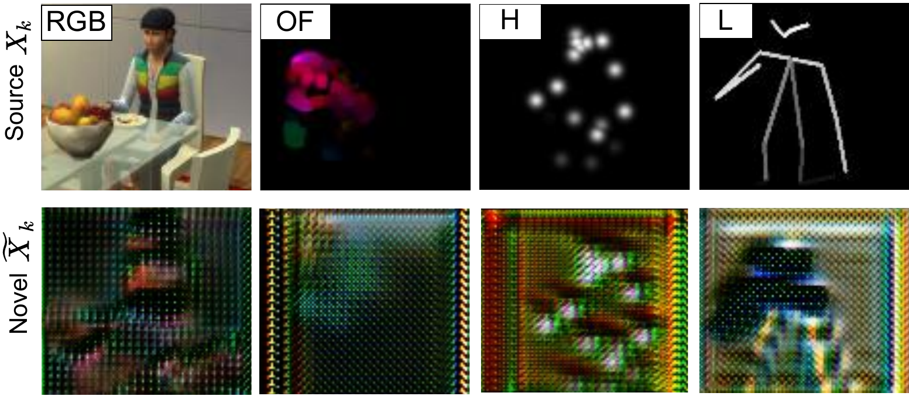
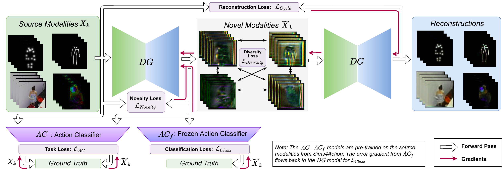
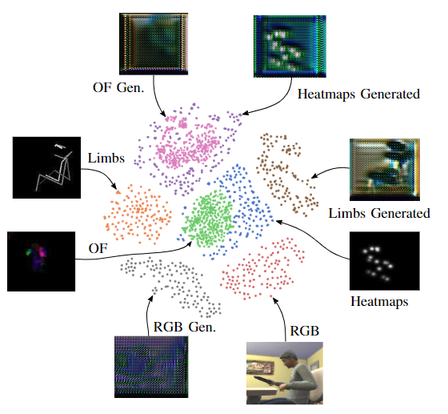

# Synthetic-to-Real Domain Adaptation for Action Recognition

Repository for multimodal action recognition using synthetic data from Sims4Action, with domain adaptation for real-world datasets (Toyota Smarthome, ETRI-Activity3D).

## Papers

This repository contains implementations for two papers:

### [MMGen (IROS 2022)](https://arxiv.org/abs/2208.01910)
**Multimodal Domain Generation for Synthetic-to-Real Activity Recognition**
- Trains only on synthetic Sims4Action data
- Generates novel modalities via adversarial domain generation
- Evaluates on real Toyota Smarthome and ETRI-Activity3D datasets
- Domain generator code in `L2A-OT/`

### [ModSelect (ECCV 2022)](https://arxiv.org/abs/2208.09414)
**Unsupervised Modality Selection for Cross-Domain Action Recognition**
- Selects beneficial modalities via correlation and MMD thresholds
- Adds YOLO object detections as a 5th modality
- Late fusion strategies (Borda Count, Sum, Product)

## Installation

```bash
git clone <repo-url>
pip install torch torchvision numpy pandas tqdm tensorboard opencv-python pillow
```

Requirements:
- PyTorch >= 1.7
- numpy, pandas, tensorboard, tqdm
- OpenCV (for video processing)

## Dataset Structure

Expected structure for each modality:
```
dataset_root/
├── <Action>/
│   └── <video_id>/
│       ├── heatmaps.avi
│       ├── limbs.avi
│       ├── optical_flow.avi
│       └── rgb.avi
```

## Modalities

| Modality | Channels | Description |
|----------|----------|-------------|
| Heatmaps (H) | 1 | Gaussian maps at AlphaPose joint locations |
| Limbs (L) | 1 | Lines connecting skeleton joints |
| Optical Flow (OF) | 3 | Farneback algorithm (HSV encoded) |
| RGB | 3 | Original video frames |
| YOLO | 80-dim | Object detection distances (ModSelect only) |

---

## MMGen Experiments

The MMGen paper trains action classifiers on synthetic data with generated novel domains to improve generalization to real-world data.

### Source and Novel Modalities

The domain generator transforms source modalities (top row) into novel synthetic domains (bottom row), creating a more diverse training set:



*H: Heatmaps, L: Limbs, OF: Optical Flow. The model trains on all 8 modalities (4 source + 4 novel) but evaluates on real data.*

### Method Overview



The approach uses three networks:
1. **Frozen Classifier (C)**: Pre-trained S3D action classifier, frozen during domain generation training
2. **Domain Generator (G)**: Transforms source modalities into novel synthetic domains
3. **Task Classifier (DGC)**: S3D trained on both source and novel modalities

Additionally, a **Domain Classifier (D)** (ResNet18) is trained to distinguish modalities and provides the Sinkhorn distance loss for training G.

### Training Pipeline

The paper evaluates all 15 modality combinations. Below we show the full 4-modality example.

#### Step 1: Pre-train Action Classifier on Source Modalities

Train an S3D classifier using early fusion (channel concatenation) on Sims4Action:

```bash
python main.py --gpu 0 1 \
    --dataset sims_video_multimodal \
    --modalities heatmaps limbs optical_flow rgb \
    --dataset_roots /path/to/sims/heatmaps /path/to/sims/limbs /path/to/sims/optical_flow /path/to/sims/rgb \
    --n_modalities 4 \
    --n_channels_each_modality 1 1 3 3 \
    --n_channels 8 \
    --epochs 200 \
    --img_dim 112 \
    --seq_len 16
```

This produces a checkpoint (e.g., `experiments/<exp>/checkpoints/best_bal_acc_model.tar`) used as the frozen classifier C.

#### Step 2: Train Domain Classifier (D)

In L2A-OT, train ResNet18 to classify which modality each frame belongs to:

```bash
cd L2A-OT
python main_SIMS_S3D.py \
    --gpu 0 1 \
    --modalities heatmaps limbs optical_flow rgb \
    --modality_indices 0 1 2 3 \
    --dataset_roots /path/to/sims/heatmaps /path/to/sims/limbs /path/to/sims/optical_flow /path/to/sims/rgb \
    --dataset_roots_test /path/to/adl/heatmaps /path/to/adl/limbs /path/to/adl/optical_flow /path/to/adl/rgb \
    --num_iterations_D 1000 \
    --num_iterations_G 0 \
    --exp_tag D_training_h_l_of_rgb
```

#### Step 3: Train Generator (G) + Task Classifier (DGC)

Train the domain generator and task classifier jointly:

```bash
cd L2A-OT
python main_SIMS_S3D.py \
    --gpu 0 1 \
    --modalities heatmaps limbs optical_flow rgb \
    --modality_indices 0 1 2 3 \
    --dataset_roots /path/to/sims/heatmaps /path/to/sims/limbs /path/to/sims/optical_flow /path/to/sims/rgb \
    --dataset_roots_test /path/to/adl/heatmaps /path/to/adl/limbs /path/to/adl/optical_flow /path/to/adl/rgb \
    --pretrained_model_C /path/to/pretrained_s3d.tar \
    --num_iterations_D 10 \
    --num_iterations_G 30000 \
    --test_every 500 \
    --save_img_every 1000 \
    --exp_tag GAN_h_l_of_rgb \
    --batch_size 6
```

The frozen classifier C (`--pretrained_model_C`) provides the classification loss to ensure generated domains preserve action semantics.

#### Step 4: Evaluate on Real Data

Evaluate the trained task classifier on Toyota Smarthome or ETRI:

```bash
cd L2A-OT
python main_SIMS_S3D.py \
    --gpu 0 1 \
    --modalities heatmaps limbs optical_flow rgb \
    --modality_indices 0 1 2 3 \
    --dataset_roots /path/to/sims/heatmaps /path/to/sims/limbs /path/to/sims/optical_flow /path/to/sims/rgb \
    --dataset_roots_test /path/to/adl/heatmaps /path/to/adl/limbs /path/to/adl/optical_flow /path/to/adl/rgb \
    --pretrained_model_DGC checkpoints/GAN_h_l_of_rgb/best_val_DGC.tar \
    --pretrained_model_G checkpoints/GAN_h_l_of_rgb/G_iteration_30000.pth \
    --test_classifier_only \
    --exp_tag eval_GAN_h_l_of_rgb
```

Outputs balanced and unbalanced accuracy on both source and novel domains.

### Modality Combinations

The paper tests all 15 combinations. Examples:

```bash
# Single modality: Limbs only
--modalities limbs --modality_indices 1 --n_channels 1

# Two modalities: Heatmaps + Limbs
--modalities heatmaps limbs --modality_indices 0 1 --n_channels 2

# Three modalities: H + L + OF
--modalities heatmaps limbs optical_flow --modality_indices 0 1 2 --n_channels 5
```

### Loss Functions

The generator is trained with:
- **Novelty Loss**: Maximizes Sinkhorn distance between source and novel modality distributions
- **Diversity Loss**: Maximizes Sinkhorn distance between different novel modalities
- **Classification Loss**: Novel modalities should be correctly classified by frozen C
- **Cycle Loss**: Reconstruction consistency (G(G(x)) ≈ x)

```
L_DG = λ_c * L_class + λ_r * L_cycle - λ_d * (L_novelty + L_diversity)
```

Default: λ_c = λ_d = 1, λ_r = 10

### Implementation Details (from paper)

- Input size: 112 × 112
- Sequence length: 16 frames
- Video chunks: 90 frames
- Optimizer: Adam (lr=1e-4, β1=0.5, β2=0.999)
- Weight decay: 5e-5
- Pre-training: 200 epochs
- Joint training: ~50 epochs equivalent

### Output Files

Training produces:
- `checkpoints/<exp_tag>/G_iteration_<N>.pth`: Generator weights
- `checkpoints/<exp_tag>/best_val_DGC.tar`: Best task classifier
- `results/<exp_tag>/*.jpg`: Sample generated images
- `runs/<exp_tag>/`: TensorBoard logs

### Domain Embedding Visualization

The t-SNE visualization below shows how the domain generator learns to produce novel modalities that are distinct from the source modalities, effectively diversifying the training distribution:



*Each color represents a different modality. Source and novel modalities form separate clusters, indicating the generator has learned to produce diverse but semantically consistent domains.*

---

## ModSelect Experiments

The ModSelect paper trains unimodal classifiers and selects beneficial modalities via late fusion.

### Step 1: Train Unimodal Classifiers

```bash
# Heatmaps
python main.py --gpu 0 1 --dataset sims_video --modality heatmaps \
    --n_channels 1 --epochs 200 --dataset_video_root /path/to/heatmaps

# Limbs
python main.py --gpu 0 1 --dataset sims_video --modality limbs \
    --n_channels 1 --epochs 200 --dataset_video_root /path/to/limbs

# Optical Flow
python main.py --gpu 0 1 --dataset sims_video --modality optical_flow \
    --n_channels 3 --epochs 200 --dataset_video_root /path/to/optical_flow

# RGB
python main.py --gpu 0 1 --dataset sims_video --modality rgb \
    --n_channels 3 --epochs 200 --dataset_video_root /path/to/rgb

# YOLO (MLP on detection vectors)
python main.py --gpu 0 1 --dataset YOLO_detections_only --model_vid YOLO_mlp --epochs 200
```

### Step 2: Late Fusion Evaluation

Combine predictions using Borda Count voting:

```bash
python utils/late_fusion_borda_count.py \
    --csv_roots results_h.csv results_l.csv results_of.csv results_rgb.csv results_yolo.csv \
    --modalities heatmaps limbs optical_flow rgb yolo
```

Other fusion strategies available:
- `utils/late_fusion_sum_square_multimodal.py`: Sum and squared sum fusion
- `utils/late_fusion_borda_count_multimodal.py`: Multi-modal Borda Count

---

## Data Preprocessing

### Generate Skeleton Modalities from AlphaPose

```bash
python utils/generate_skeletons_heatmaps.py \
    --root_dir /path/to/alphapose_results \
    --result_dir /path/to/output
```

Produces both heatmaps and limbs modalities.

### Generate Optical Flow

```bash
python utils/generate_optical_flow.py \
    --root_dir /path/to/rgb_videos \
    --result_dir /path/to/output \
    --n_workers 3
```

---

## Key Arguments

| Argument | Description |
|----------|-------------|
| `--dataset` | `sims_video`, `sims_video_multimodal`, `adl`, `YOLO_detections_only` |
| `--model_vid` | `s3d`, `i3d`, `YOLO_mlp`, `s3d_yolo_fusion` |
| `--modality` | Single modality: `heatmaps`, `limbs`, `optical_flow`, `rgb` |
| `--modalities` | Multiple modalities for early fusion |
| `--n_channels` | Total input channels (sum of all modalities) |
| `--G_path` | Domain generator checkpoint for inference (MMGen) |
| `--split_policy` | `frac`, `cross-subject`, `cross-view-1`, `cross-view-2` |

### L2A-OT Specific Arguments

| Argument | Description |
|----------|-------------|
| `--pretrained_model_C` | Frozen classifier for classification loss |
| `--pretrained_model_DGC` | Task classifier checkpoint |
| `--pretrained_model_G` | Generator checkpoint |
| `--num_iterations_D` | Domain classifier training iterations |
| `--num_iterations_G` | Generator + task classifier training iterations |
| `--test_classifier_only` | Evaluation mode (no training) |

---

## Monitoring

```bash
tensorboard --logdir experiments/<exp-folder>/logs
# or for L2A-OT:
tensorboard --logdir L2A-OT/runs/<exp_tag>
```

---

## Project Structure

```
├── main.py                 # Entry point for classifier training
├── lib/                    # Model architectures (S3D, I3D, YOLO MLP)
├── datasets/               # Data loaders
├── training/               # Training loops
├── testing/                # Evaluation scripts
├── utils/                  # Preprocessing and fusion utilities
└── L2A-OT/                 # Domain generator training (MMGen)
    ├── main_SIMS_S3D.py    # Main training script
    ├── model.py            # Generator architecture (StarGAN-style)
    ├── resnet.py           # Domain classifier (ResNet18)
    ├── lib/                # S3D backbone
    └── utils/              # Sinkhorn loss, augmentation
```

---

## References

- MMGen is based on [L2A-OT: Learning to Generate Novel Domains for Domain Generalization (ECCV 2020)](https://arxiv.org/abs/2007.03304)
- S3D architecture from [Rethinking Spatiotemporal Feature Learning (ECCV 2018)](https://arxiv.org/abs/1712.04851)
